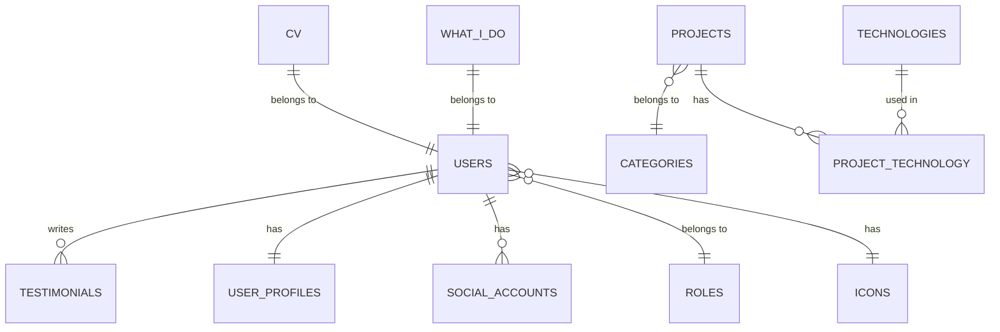

# Portfolio Marzio Farina - Documentazione Completa

## 📋 Indice

1. [Panoramica del Progetto](#panoramica-del-progetto)
2. [Architettura del Sistema](#architettura-del-sistema)
3. [Backend Laravel](#backend-laravel)
4. [Frontend Angular](#frontend-angular)
5. [Database](#database)
6. [API Endpoints](#api-endpoints)
7. [Deployment](#deployment)
8. [Sviluppo e Contribuzione](#sviluppo-e-contribuzione)
9. [Troubleshooting](#troubleshooting)

---

## 🎯 Panoramica del Progetto

**Portfolio Marzio Farina** è un'applicazione web full-stack che presenta il portfolio professionale di Marzio Farina, sviluppatore full-stack specializzato in Laravel, Angular e tecnologie Microsoft.

### Caratteristiche Principali
- **Frontend**: Angular 20 con TailwindCSS e DaisyUI
- **Backend**: Laravel 12 con API REST
- **Database**: SQLite (locale) / PostgreSQL (produzione)
- **Autenticazione**: Laravel Sanctum
- **Deployment**: Vercel (frontend) + Vercel Functions (backend)

### Tecnologie Utilizzate

#### Backend
- **Laravel 12** - Framework PHP
- **Laravel Sanctum** - Autenticazione API
- **Intervention Image** - Elaborazione immagini
- **AWS SDK** - Integrazione servizi cloud

#### Frontend
- **Angular 20** - Framework TypeScript
- **TailwindCSS 4** - Framework CSS
- **DaisyUI 5** - Componenti UI
- **RxJS** - Gestione reattiva

---

## 🏗️ Architettura del Sistema

```
┌─────────────────┐    ┌─────────────────┐    ┌─────────────────┐
│   Frontend      │    │   Backend       │    │   Database      │
│   Angular 20    │◄──►│   Laravel 12    │◄──►│   SQLite/PG     │
│   TailwindCSS   │    │   API REST      │    │   Supabase      │
│   DaisyUI       │    │   Sanctum Auth  │    │                 │
└─────────────────┘    └─────────────────┘    └─────────────────┘
         │                       │
         │                       │
         ▼                       ▼
┌─────────────────┐    ┌─────────────────┐
│   Vercel CDN    │    │   Vercel        │
│   Static Host   │    │   Functions     │
└─────────────────┘    └─────────────────┘
```

### Flusso di Dati
1. **Frontend** fa richieste HTTP al **Backend**
2. **Backend** elabora le richieste e interroga il **Database**
3. **Database** restituisce i dati al **Backend**
4. **Backend** formatta i dati tramite **API Resources** e li invia al **Frontend**
5. **Frontend** aggiorna l'interfaccia utente

---

## 🔧 Backend Laravel

### Struttura del Progetto

```
backend/
├── app/
│   ├── Http/
│   │   ├── Controllers/
│   │   │   ├── Api/           # Controller API
│   │   │   ├── AuthController.php
│   │   │   └── ContactController.php
│   │   ├── Middleware/        # Middleware personalizzati
│   │   ├── Requests/          # Form Request validation
│   │   └── Resources/         # API Resources
│   ├── Mail/                  # Email templates
│   ├── Models/                # Eloquent Models
│   └── Providers/             # Service Providers
├── database/
│   ├── migrations/            # Migrazioni database
│   ├── seeders/              # Seeder per dati iniziali
│   └── factories/            # Factory per testing
├── routes/
│   ├── api.php               # Route API
│   └── web.php               # Route web
└── config/                   # Configurazioni
```

### Modelli Principali

#### User
```php
class User extends Authenticatable
{
    protected $fillable = ['name', 'surname', 'email', 'password', 'date_of_birth', 'role_id', 'icon_id'];
    
    // Relazioni
    public function role() { return $this->belongsTo(Role::class); }
    public function icon() { return $this->belongsTo(Icon::class); }
    public function testimonials() { return $this->hasMany(Testimonial::class); }
    public function profile() { return $this->hasOne(UserProfile::class); }
    public function socialAccounts() { return $this->hasMany(SocialAccount::class); }
}
```

#### Project
```php
class Project extends Model
{
    protected $fillable = ['title', 'description', 'poster', 'video', 'category_id'];
    
    // Relazioni
    public function category() { return $this->belongsTo(Category::class); }
    public function technologies() { return $this->belongsToMany(Technology::class); }
}
```

#### Testimonial
```php
class Testimonial extends Model
{
    protected $fillable = ['text', 'role_company', 'company', 'rating', 'user_id', 'author'];
    
    // Relazioni
    public function user() { return $this->belongsTo(User::class); }
}
```

### Controller API

#### TestimonialController
```php
class TestimonialController extends Controller
{
    public function index(Request $request)
    {
        $perPage = (int) $request->query('per_page', 12);
        
        $query = Testimonial::query()
            ->with(['user:id,name,surname'])
            ->orderByDesc('id');
            
        $paginator = $query->paginate($perPage);
        
        return TestimonialResource::collection($paginator)
            ->additional([
                'meta' => [
                    'current_page' => $paginator->currentPage(),
                    'per_page' => $paginator->perPage(),
                    'total' => $paginator->total(),
                    'last_page' => $paginator->lastPage(),
                ],
            ]);
    }
}
```

### Middleware Personalizzati

#### HttpCache
```php
class HttpCache
{
    public function handle(Request $request, Closure $next, int $ttl = 300)
    {
        $response = $next($request);
        
        if ($request->isMethod('GET') && $response->getStatusCode() === 200) {
            $response->headers->set('Cache-Control', "max-age={$ttl}, public");
            $response->headers->set('ETag', md5($response->getContent()));
        }
        
        return $response;
    }
}
```

### API Resources

#### TestimonialResource
```php
class TestimonialResource extends JsonResource
{
    public function toArray(Request $request): array
    {
        return [
            'id' => (string) $this->id,
            'author' => $this->getAuthorName(),
            'text' => $this->text,
            'role' => $this->role_company,
            'company' => $this->company,
            'rating' => (int) $this->rating,
        ];
    }
    
    private function getAuthorName(): ?string
    {
        if ($this->author) return $this->author;
        if ($this->user) return $this->user->name ?? null;
        return null;
    }
}
```

---

## 🎨 Frontend Angular

### Struttura del Progetto

```
frontend/src/app/
├── components/           # Componenti riutilizzabili
│   ├── auth/            # Autenticazione
│   ├── aside/           # Sidebar
│   ├── cv/              # CV component
│   ├── footer/          # Footer
│   ├── header/          # Header
│   ├── projects/        # Progetti
│   └── testimonials/    # Testimonianze
├── core/                # Servizi core
│   ├── api-cache.interceptor.ts
│   ├── auth.interceptor.ts
│   └── http-cache.interceptor.ts
├── pages/               # Pagine principali
│   ├── about/           # Pagina About
│   ├── contact/         # Pagina Contatto
│   ├── home/            # Homepage
│   └── projects/        # Pagina Progetti
├── services/            # Servizi Angular
│   ├── auth.service.ts
│   ├── project.service.ts
│   └── testimonial.service.ts
└── app.ts               # Componente principale
```

### Servizi Principali

#### AuthService
```typescript
@Injectable({ providedIn: 'root' })
export class AuthService {
  private token = signal<string | null>(null);
  private user = signal<User | null>(null);
  
  // Metodi
  login(credentials: LoginDto): Observable<AuthResponse> { /* ... */ }
  register(data: RegisterDto): Observable<AuthResponse> { /* ... */ }
  logout(): void { /* ... */ }
  isAuthenticated(): boolean { /* ... */ }
}
```

#### ProjectService
```typescript
@Injectable({ providedIn: 'root' })
export class ProjectService {
  list$(page = 1, perPage = 12): Observable<Paginated<Progetto>> {
    const url = apiUrl('projects');
    return this.http.get<Paginated<ProjectDto>>(url, { 
      params: { page, per_page: perPage } 
    }).pipe(
      map(response => ({
        ...response,
        data: (response.data ?? []).map(this.dtoToProgetto)
      }))
    );
  }
}
```

### Interceptors

#### ApiCacheInterceptor
```typescript
@Injectable()
export class ApiCacheInterceptor implements HttpInterceptor {
  private cache = new Map<string, CacheEntry>();
  private inflight = new Map<string, { subject: Subject<HttpEvent<any>>; sub: Subscription | null }>();
  
  intercept(req: HttpRequest<any>, next: HttpHandler): Observable<HttpEvent<any>> {
    // Logica di cache intelligente
    const isCacheable = req.method === 'GET' && req.url.includes('/api/');
    if (!isCacheable) return next.handle(req);
    
    // Gestione cache con TTL e ETag
    // ...
  }
}
```

### Componenti Principali

#### App Component
```typescript
@Component({
  selector: 'app-root',
  standalone: true,
  imports: [RouterOutlet, Header, Aside, Footer],
  template: `
    <div class="min-h-screen bg-base-100">
      <app-header />
      <div class="flex">
        <app-aside />
        <main class="flex-1">
          <router-outlet />
        </main>
      </div>
      <app-footer />
    </div>
  `
})
export class App {
  constructor() {
    this.initializeIdleTimeout();
    this.setupAuthenticationEffect();
    this.setupIdleTimeoutHandler();
  }
}
```

---

## 🗄️ Database

### Schema Principale

#### Tabelle Utenti
```sql
-- Users
CREATE TABLE users (
    id BIGINT PRIMARY KEY,
    name VARCHAR(255) NOT NULL,
    surname VARCHAR(255) NOT NULL,
    email VARCHAR(255) UNIQUE NOT NULL,
    password VARCHAR(255) NOT NULL,
    date_of_birth DATE,
    role_id BIGINT REFERENCES roles(id),
    icon_id BIGINT REFERENCES icons(id),
    created_at TIMESTAMP,
    updated_at TIMESTAMP
);

-- User Profiles
CREATE TABLE user_profiles (
    id BIGINT PRIMARY KEY,
    user_id BIGINT REFERENCES users(id),
    title VARCHAR(255),
    bio TEXT,
    avatar_url VARCHAR(500),
    created_at TIMESTAMP,
    updated_at TIMESTAMP
);
```

#### Tabelle Contenuto
```sql
-- Projects
CREATE TABLE projects (
    id BIGINT PRIMARY KEY,
    title VARCHAR(255) NOT NULL,
    description TEXT,
    poster VARCHAR(500),
    video VARCHAR(500),
    category_id BIGINT REFERENCES categories(id),
    created_at TIMESTAMP,
    updated_at TIMESTAMP
);

-- Testimonials
CREATE TABLE testimonials (
    id BIGINT PRIMARY KEY,
    text TEXT NOT NULL,
    role_company VARCHAR(255),
    company VARCHAR(255),
    rating INTEGER CHECK (rating >= 1 AND rating <= 5),
    user_id BIGINT REFERENCES users(id),
    author VARCHAR(255),
    created_at TIMESTAMP,
    updated_at TIMESTAMP
);
```

### Relazioni



---

## 🌐 API Endpoints

### Endpoint Pubblici

#### Testimonials
```http
GET /api/testimonials?page=1&per_page=12
```
**Risposta:**
```json
{
  "data": [
    {
      "id": "1",
      "author": "Mario Rossi",
      "text": "Ottimo lavoro!",
      "role": "CEO",
      "company": "Azienda SRL",
      "rating": 5
    }
  ],
  "meta": {
    "current_page": 1,
    "per_page": 12,
    "total": 25,
    "last_page": 3
  }
}
```

#### Projects
```http
GET /api/projects?page=1&per_page=12
```
**Risposta:**
```json
{
  "data": [
    {
      "id": "1",
      "title": "Progetto Example",
      "description": "Descrizione progetto",
      "poster": "https://example.com/poster.jpg",
      "video": "https://example.com/video.mp4",
      "category": {
        "id": 1,
        "title": "Web Development"
      },
      "technologies": [
        {
          "id": 1,
          "title": "Laravel",
          "description": "PHP Framework"
        }
      ]
    }
  ]
}
```

#### What I Do
```http
GET /api/what-i-do
```
**Risposta:**
```json
{
  "items": [
    {
      "id": 1,
      "title": "Web Development",
      "description": "Siti e app web performanti",
      "icon": "code"
    }
  ]
}
```

### Endpoint Autenticati

#### Login
```http
POST /api/auth/login
Content-Type: application/json

{
  "email": "user@example.com",
  "password": "password123"
}
```

#### Register
```http
POST /api/auth/register
Content-Type: application/json

{
  "name": "Mario",
  "surname": "Rossi",
  "email": "mario@example.com",
  "password": "password123",
  "confirm": "password123",
  "terms": true
}
```

#### Contact Form
```http
POST /api/contact
Content-Type: application/json
Authorization: Bearer {token}

{
  "name": "Mario",
  "surname": "Rossi",
  "email": "mario@example.com",
  "subject": "Richiesta informazioni",
  "message": "Messaggio di contatto",
  "consent": true
}
```

---

## 🚀 Deployment

### Configurazione Vercel

#### Backend (vercel.json)
```json
{
  "version": 2,
  "builds": [
    {
      "src": "public/index.php",
      "use": "@vercel/php"
    }
  ],
  "routes": [
    {
      "src": "/(.*)",
      "dest": "public/index.php"
    }
  ],
  "env": {
    "APP_ENV": "production",
    "APP_DEBUG": "false"
  }
}
```

#### Frontend (vercel.json)
```json
{
  "version": 2,
  "builds": [
    {
      "src": "dist/Portfolio/index.html",
      "use": "@vercel/static"
    }
  ],
  "routes": [
    {
      "src": "/(.*)",
      "dest": "dist/Portfolio/index.html"
    }
  ]
}
```

### Variabili d'Ambiente

#### Backend (.env)
```env
APP_NAME=Portfolio
APP_ENV=production
APP_DEBUG=false
APP_URL=https://api.marziofarina.it

DB_CONNECTION=pgsql
DB_HOST=db.your-project.supabase.co
DB_PORT=5432
DB_DATABASE=postgres
DB_USERNAME=postgres
DB_PASSWORD=your-password

MAIL_MAILER=smtp
MAIL_HOST=smtp.gmail.com
MAIL_PORT=587
MAIL_USERNAME=your-email@gmail.com
MAIL_PASSWORD=your-app-password
```

#### Frontend (environment.prod.ts)
```typescript
export const environment = {
  production: true,
  apiUrl: 'https://api.marziofarina.it/api',
  appName: 'Portfolio Marzio Farina'
};
```

---

## 🛠️ Sviluppo e Contribuzione

### Setup Locale

#### Backend
```bash
cd backend
composer install
cp .env.example .env
php artisan key:generate
php artisan migrate --seed
php artisan serve
```

#### Frontend
```bash
cd frontend
npm install
npm start
```

### Script di Sviluppo

#### Backend
```bash
# Sviluppo con hot reload
composer run dev

# Test
composer run test

# Setup completo
composer run setup
```

#### Frontend
```bash
# Sviluppo
npm start

# Build produzione
npm run build

# Test
npm test
```

### Struttura Git

```
main                    # Branch principale (produzione)
├── develop            # Branch di sviluppo
├── feature/auth       # Feature branch
├── feature/projects   # Feature branch
└── hotfix/bug-fix    # Hotfix branch
```

### Code Style

#### Backend (Laravel Pint)
```bash
./vendor/bin/pint
```

#### Frontend (Prettier)
```bash
npx prettier --write "src/**/*.{ts,html,css}"
```

---

## 🔧 Troubleshooting

### Problemi Comuni

#### 1. Errore 500 su API
**Sintomi:** `GET /api/testimonials 500 (Internal Server Error)`

**Soluzioni:**
```bash
# Controlla log
tail -f storage/logs/laravel.log

# Pulisci cache
php artisan cache:clear
php artisan config:clear

# Verifica database
php artisan migrate:status
```

#### 2. Errori CORS
**Sintomi:** `Access to fetch at 'https://api.marziofarina.it' from origin 'https://marziofarina.it' has been blocked by CORS policy`

**Soluzioni:**
```php
// config/cors.php
'allowed_origins' => [
    'https://marziofarina.it',
    'http://localhost:4200'
],
```

#### 3. Problemi di Autenticazione
**Sintomi:** `401 Unauthorized` su endpoint protetti

**Soluzioni:**
```bash
# Verifica token
php artisan tinker
>>> Sanctum::personalAccessTokenModel()::where('token', 'your-token')->first()

# Pulisci token scaduti
php artisan sanctum:prune-expired
```

#### 4. Errori di Build Frontend
**Sintomi:** Errori TypeScript durante il build

**Soluzioni:**
```bash
# Pulisci node_modules
rm -rf node_modules package-lock.json
npm install

# Verifica TypeScript
npx tsc --noEmit

# Build con verbose
ng build --verbose
```

### Monitoraggio

#### Log Files
```bash
# Backend logs
tail -f storage/logs/laravel.log

# Nginx logs (se applicabile)
tail -f /var/log/nginx/error.log

# Vercel logs
vercel logs
```

#### Health Checks
```bash
# API Health
curl https://api.marziofarina.it/api/ping

# Database connection
php artisan tinker
>>> DB::connection()->getPdo()
```

---

## 📞 Supporto

Per problemi o domande:

1. **Issues GitHub** - Per bug e feature request
2. **Email** - marzio@marziofarina.it
3. **Documentazione** - Questo file e commenti nel codice

---

## 📄 Licenza

Questo progetto è proprietario di Marzio Farina. Tutti i diritti riservati.

---

*Ultima modifica: 22 Ottobre 2025*
*Versione: 1.0.0*
