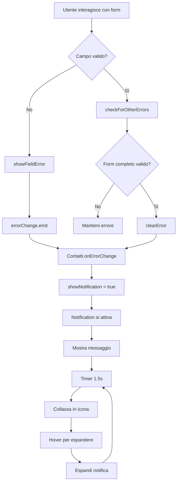

# 📋 Documentazione Sistema di Notifiche

**Versione**: 2.0 | **Ultimo Aggiornamento**: 25/10/2025

## 🎯 Panoramica del Sistema

Il sistema di notifiche è composto da tre componenti principali che lavorano insieme per gestire la comunicazione con l'utente:

1. **`Notification`** - Componente di visualizzazione delle notifiche
2. **`ContactForm`** - Form di contatto che genera eventi di errore/successo
3. **`Contatti`** - Pagina che coordina la comunicazione tra form e notifiche

### 🆕 Novità v2.0
- ✅ Gestione intelligente delle notifiche duplicate
- ✅ Approccio mobile-first per design responsive
- ✅ Tooltip informativi nei campi form
- ✅ Ottimizzazioni CLS (Cumulative Layout Shift)

---

## 🧩 Architettura del Sistema

```
┌─────────────────┐    errorChange     ┌─────────────────┐    [message, type, show]    ┌─────────────────┐
│   ContactForm   │ ──────────────────► │    Contatti     │ ──────────────────────────► │   Notification  │
│                 │                     │                 │                             │                 │
│ - Validazione   │                     │ - Gestione      │                             │ - Visualizzazione│
│ - Submit        │                     │   stato         │                             │ - Animazioni    │
│ - Errori        │                     │ - Coordinamento │                             │ - Auto-collapse │
└─────────────────┘                     └─────────────────┘                             └─────────────────┘
```

---

## 📁 Componenti Dettagliati

### 1. 🎨 **Notification Component**

#### **File**: `frontend/src/app/components/notification/notification.ts`

**Responsabilità**: Visualizzazione e animazione delle notifiche

#### **Inputs**:
```typescript
message = input<string>('');           // Messaggio da visualizzare
type = input<NotificationType>('info'); // Tipo: 'success' | 'error' | 'warning' | 'info'
show = input<boolean>(false);          // Se mostrare la notifica
autoCollapse = input<boolean>(true);   // Se collassare automaticamente
collapseDelay = input<number>(1500);   // Delay prima del collasso (1.5s)
```

#### **Stato Interno**:
```typescript
isCollapsed = signal(false);           // Se la notifica è collassata
isIconInCorner = signal(false);        // Se l'icona è nell'angolo
private collapseTimer?: number;        // Timer per auto-collapse
```

#### **Funzionalità Principali**:

1. **Auto-Collapse**: Dopo 1.5 secondi, la notifica si collassa in un'icona nell'angolo
2. **Animazioni**: Transizioni fluide per collasso ed espansione
3. **Hover**: Hover sull'icona espande la notifica
4. **Icone Dinamiche**: Icone diverse per ogni tipo di notifica
5. **🆕 Gestione Duplicati**: Rileva e gestisce notifiche duplicate
6. **🆕 Responsive Design**: Approccio mobile-first con breakpoint multipli

#### **Ciclo di Vita**:
```
Notifica Arriva → Verifica Duplicato?
                   ├─ SÌ: Mostra 1.5s → Rimuovi (non aggiunge alla lista)
                   └─ NO: Aggiungi → Mostra → Timer 1.5s → Collassa → Icona Angolo → Hover → Espandi → ...
```

---

### 2. 📝 **ContactForm Component**

#### **File**: `frontend/src/app/components/contact-form/contact-form.ts`

**Responsabilità**: Gestione del form e generazione di eventi di errore/successo

#### **Validatori**:
```typescript
form = this.fb.group({
  name: ['', [Validators.required, Validators.minLength(2)]],
  surname: ['', [Validators.required, Validators.minLength(2)]],
  email: ['', [Validators.required, Validators.email]],
  subject: [''], // Opzionale
  message: ['', [Validators.required, Validators.minLength(10)]],
  consent: [false, [Validators.requiredTrue]],
  website: [''] // Honeypot
});
```

#### **Output**:
```typescript
errorChange = output<string | undefined>();
```

#### **Flusso di Validazione**:

1. **Validazione in Tempo Reale**:
   ```typescript
   // Ogni campo ha un listener per valueChanges
   this.form.get('name')?.valueChanges.subscribe(() => this.validateField('name'));
   ```

2. **Validazione all'Uscita**:
   ```typescript
   onFieldBlur(fieldName: string) {
     field.markAsTouched();
     this.validateField(fieldName);
   }
   ```

3. **Validazione al Submit**:
   ```typescript
   if (this.form.invalid) {
     this.form.markAllAsTouched();
     this.showValidationError();
   }
   ```

#### **Tipi di Errori Gestiti**:

| Campo | Errore Required | Errore MinLength | Messaggio |
|-------|----------------|------------------|-----------|
| Campo | Errore Required | Errore MinLength/Email | Tooltip |
|-------|----------------|----------------------|---------|
| `name` | "Il nome è obbligatorio" | "Il nome deve contenere almeno 2 caratteri" | "Inserisci il tuo nome" |
| `surname` | "Il cognome è obbligatorio" | "Il cognome deve contenere almeno 2 caratteri" | "Inserisci il tuo cognome" |
| `email` | "L'email è obbligatoria" | "Inserisci una email valida" | "Inserisci un indirizzo email valido" |
| `message` | "Il messaggio è obbligatorio" | "Il messaggio deve contenere almeno 10 caratteri" | "Scrivi minimo 10 caratteri" |
| `consent` | "Devi acconsentire al trattamento dei dati" | - | - |

---

### 3. 🏠 **Contatti Component**

#### **File**: `frontend/src/app/pages/contatti/contatti.ts`

**Responsabilità**: Coordinamento tra form e notifiche

#### **Stato**:
```typescript
showNotification = false;                    // Se mostrare la notifica
notificationMessage = '';                    // Messaggio da mostrare
notificationType: 'success' | 'error' | 'warning' | 'info' = 'error';
```

#### **Gestione Eventi**:
```typescript
onErrorChange(error: string | undefined) {
  if (error) {
    this.notificationMessage = error;
    this.notificationType = 'error';        // Sempre 'error' per ora
    this.showNotification = true;
  } else {
    this.showNotification = false;
  }
}
```

---

## 🔄 Flusso di Funzionamento

### **Scenario 1: Errore di Validazione**

1. **Utente esce da un campo invalido**:
   ```
   ContactForm.onFieldBlur() → validateField() → showFieldError() → errorChange.emit()
   ```

2. **Contatti riceve l'evento**:
   ```
   onErrorChange() → showNotification = true → Notification si attiva
   ```

3. **Notification riceve e verifica**:
   ```
   show() = true → Verifica duplicato → Mostra messaggio → Timer 1.5s → Collassa → Icona angolo
   ```

### **Scenario 2: Submit con Errori**

1. **Utente clicca "Invia"**:
   ```
   ContactForm.submit() → form.invalid → showValidationError() → errorChange.emit()
   ```

2. **Stesso flusso di Scenario 1**

### **Scenario 3: Submit con Successo**

1. **Form valido, invio riuscito**:
   ```
   ContactForm.submit() → api.send() → next() → sent = true
   ```

2. **Nessuna notifica di errore** (per ora)

### **Scenario 4: Errore di Invio**

1. **Form valido, invio fallito**:
   ```
   ContactForm.submit() → api.send() → error() → errorChange.emit()
   ```

2. **Stesso flusso di Scenario 1**

---

## 🔄 Gestione Notifiche Duplicate

### **Logica di Rilevamento**:

Quando una nuova notifica arriva, il sistema verifica se un messaggio con lo stesso contenuto è già presente nella lista delle notifiche visibili o collassate.

#### **Comportamento**:
- **Se duplicato**: La notifica viene mostrata per 1.5 secondi ma **non viene aggiunta** alla lista permanente. Dopo 1.5s viene automaticamente rimossa senza lasciare traccia.
- **Se nuovo**: La notifica viene aggiunta alla lista permanente e segue il normale ciclo di vita (mostra → collassa → icona angolo → hover → espandi).

#### **Vantaggi**:
✅ Evita la proliferazione di notifiche duplicate  
✅ Fornisce comunque feedback visivo all'utente  
✅ Mantiene la lista delle notifiche pulita e leggibile  
✅ Migliora l'esperienza utente

---

## 📱 Responsive Design

### **Approccio Mobile-First**

Il sistema di notifiche adotta un approccio **mobile-first**, partendo da uno stile base ottimizzato per dispositivi mobili e progressivamente migliorando per schermi più grandi.

#### **Breakpoint**:

| Dispositivo | Breakpoint | Caratteristiche Principali |
|-------------|-----------|---------------------------|
| **Mobile** | `< 768px` | Full-width, font ridotto, word-wrap abilitato, padding compatto |
| **Tablet** | `≥ 768px` | Centrato, max-width 600px, font medio, no-wrap |
| **Desktop** | `≥ 1024px` | Max-width 50%, font standard, dimensioni icona standard |

#### **Differenze Chiave**:

##### **Mobile (< 768px)**
```css
- Position: fixed (top: 16px, left: 16px, right: 16px)
- Max-width: 100%
- Font-size: 0.875rem (14px)
- Padding: 12px
- Icone: 18px
- Corner icon: 44px
- Word-wrap: break-word
- Border-radius: 8px
```

##### **Tablet (≥ 768px)**
```css
- Position: fixed (top: 24px, left: 50%, transform: translateX(-50%))
- Max-width: 600px
- Font-size: 0.9rem (14.4px)
- Padding: 16px
- Icone: 20px
- Corner icon: 50px
- Word-wrap: normal
- Border-radius: 12px
```

##### **Desktop (≥ 1024px)**
```css
- Position: fixed (top: 24px, right: 24px)
- Max-width: 50%
- Font-size: 0.9rem (14.4px)
- Padding: 16px
- Icone: 20px
- Corner icon: 50px
- Word-wrap: normal
```

---

## 🎨 Stili e Animazioni

### **CSS Classes**:

```css
.notification                    /* Contenitore principale */
.notification__message-container /* Contenitore del messaggio */
.notification__message          /* Testo del messaggio */
.notification__icon-container   /* Contenitore icona normale */
.notification__corner-icon      /* Icona nell'angolo */
.notification__icon             /* Icona SVG */
```

### **Tipi di Notifica**:

```css
.notification--success  /* Verde - #10b981 */
.notification--error    /* Rosso - #ef4444 */
.notification--warning  /* Arancione - #f59e0b */
.notification--info     /* Blu - #3b82f6 */
```

### **Animazioni**:

1. **Mostra**: Fade in + slide down
2. **Collassa**: Slide up + fade out
3. **Icona Angolo**: Appare con scale + fade in
4. **Hover**: Scale up + shadow (mobile: effetto attenuato)
5. **Espandi**: Slide down + fade in
6. **🆕 Duplicato**: Flash + rimozione automatica dopo 1.5s

---

## 🚀 Punti di Forza

1. **Separazione delle Responsabilità**: Ogni componente ha un ruolo specifico
2. **Reattività**: Usa Angular Signals per aggiornamenti automatici
3. **Animazioni Fluide**: Transizioni smooth con requestAnimationFrame
4. **Accessibilità**: Supporto per screen reader e navigazione da tastiera
5. **Temi**: Supporto per tema chiaro/scuro
6. **Honeypot**: Protezione anti-spam integrata
7. **🆕 Gestione Duplicati**: Sistema intelligente per evitare notifiche ridondanti
8. **🆕 Mobile-First**: Design responsive ottimizzato per tutti i dispositivi
9. **🆕 Tooltip Informativi**: Guidano l'utente nella compilazione del form
10. **🆕 CLS Ottimizzato**: Cumulative Layout Shift ridotto per migliori metriche Web Vitals

---

## 🔧 Possibili Miglioramenti Future

1. **Notifiche Multiple**: Supporto per più notifiche contemporanee già implementato
2. **Tipi Dinamici**: Diversi tipi di notifica per diversi errori
3. **Notifiche di Successo**: Feedback positivo per invio riuscito
4. **Persistenza**: Salvare notifiche in localStorage
5. **Queue System**: Miglioramento del sistema di coda per notifiche multiple
6. **Custom Duration**: Durata personalizzabile per tipo di notifica
7. **Gestione Offline**: Notifiche offline per feedback persistente

---

## 📊 Diagramma di Flusso



---

## 🧪 Test Scenarios

### **Test 1: Validazione Campo**
1. Vai su campo "Nome"
2. Digita "a" (troppo corto)
3. Esci dal campo
4. **Risultato atteso**: Notifica "Il nome deve contenere almeno 2 caratteri"

### **Test 2: Submit con Errori**
1. Lascia tutti i campi vuoti
2. Clicca "Invia"
3. **Risultato atteso**: Notifica con tutti gli errori separati da virgola

### **Test 3: Auto-Collapse**
1. Genera una notifica
2. Aspetta 1.5 secondi
3. **Risultato atteso**: Notifica collassa in icona nell'angolo

### **Test 4: Hover**
1. Genera una notifica e aspetta che collassi
2. Hover sull'icona nell'angolo
3. **Risultato atteso**: Notifica si espande

---

## 📝 Note Tecniche

- **Angular Version**: 17+
- **Reactive Forms**: Validazione reattiva
- **Signals**: Gestione stato reattivo
- **ViewChild**: Accesso diretto al DOM per animazioni
- **requestAnimationFrame**: Animazioni smooth
- **CSS Custom Properties**: Supporto temi
- **TypeScript**: Tipizzazione forte per type safety

---

## 📝 Note Tecniche Aggiornate

- **Angular Version**: 17+
- **Reactive Forms**: Validazione reattiva
- **Signals**: Gestione stato reattivo
- **ViewChild**: Accesso diretto al DOM per animazioni
- **requestAnimationFrame**: Animazioni smooth
- **CSS Custom Properties**: Supporto temi
- **TypeScript**: Tipizzazione forte per type safety
- **🆕 Mobile-First CSS**: Breakpoint multipli (768px, 1024px)
- **🆕 Media Queries**: `@media (min-width: 768px)` e `@media (min-width: 1024px)`
- **🆕 Responsive Icons**: Dimensioni adattive per icona e corner icon
- **🆕 Word Break**: Gestione intelligente degli a capo su mobile

---

## 🎯 Changelog v2.0

### Aggiunto
- Sistema di gestione notifiche duplicate
- Approccio mobile-first per design responsive
- Tooltip informativi nei campi form
- Supporto multi-breakpoint (mobile/tablet/desktop)
- Ottimizzazioni CLS per Web Vitals
- Word-break intelligente per testi lunghi

### Migliorato
- Responsive design con breakpoint multipli
- Icone adattive per diverse dimensioni schermo
- Hover effects ottimizzati per touch devices
- Border-radius adattivi per device
- Performance generale del sistema

### Rimozioni
- Nessuna rimozione significativa

---

*Documentazione generata per il sistema di notifiche del Portfolio - Versione 2.0*
